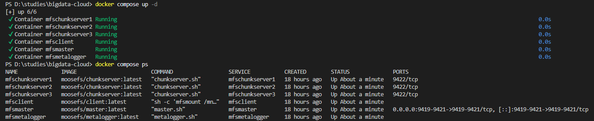
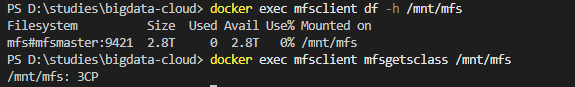
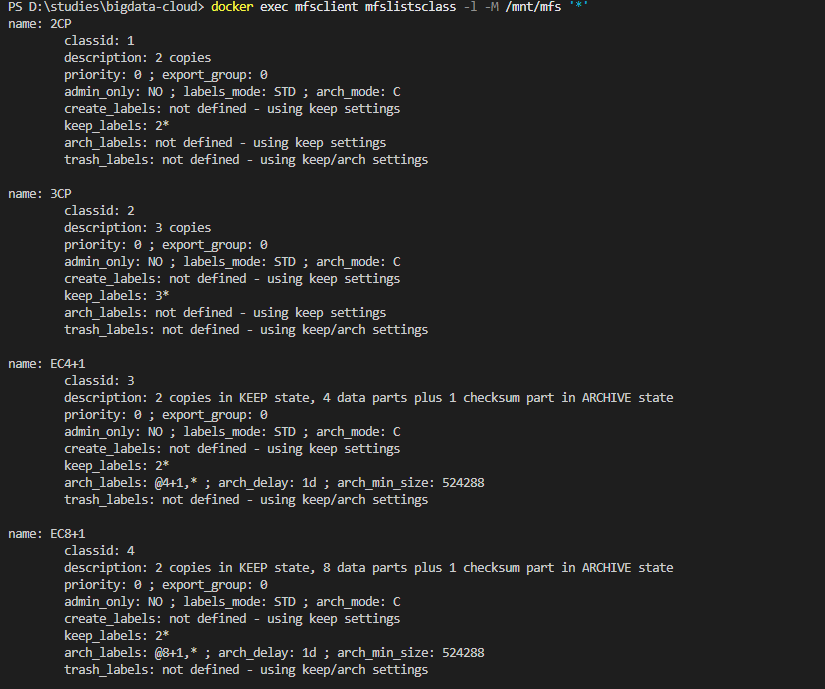
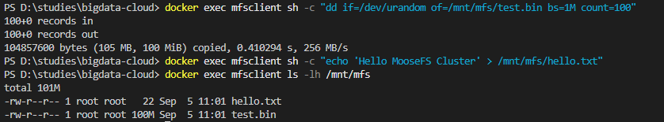
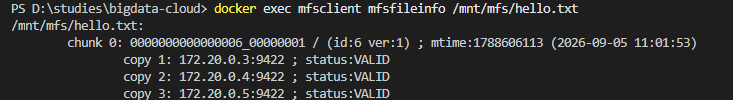
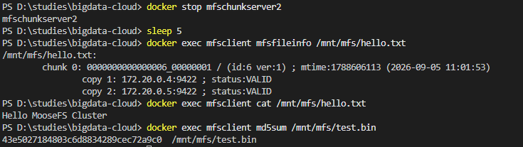
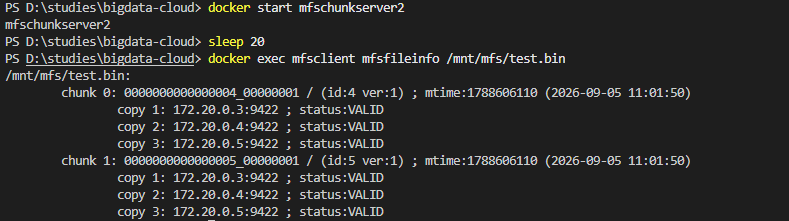

# Отчет по лабораторной работе
## Тема: Установка и настройка минимального демонстрационного стенда распределенной файловой системы MooseFS (мультинодовый режим)

**Выполнил:** Ильин Николай Александрович, АСУ8-25-1М

---

## 1. Цель работы

Развернуть минимальный демонстрационный стенд распределенной файловой системы **MooseFS** в мультинодовом режиме на базе Docker-контейнеров, проверить работу репликации chunk'ов между несколькими chunk-серверами и продемонстрировать отказоустойчивость при выходе одного из узлов хранения из строя.

---

## 2. Используемые технологии

| Компонент | Версия | Назначение |
|-----------|--------|------------|
| **MooseFS Master** | 4.x | Сервер метаданных (единая точка управления) |
| **MooseFS Metalogger** | 4.x | Резервное хранилище журнала метаданных |
| **MooseFS Chunkserver** | 4.x | Узел хранения данных (chunk'ов по 64 МБ) |
| **MooseFS Client** | 4.x | FUSE-клиент для монтирования MFS |
| **Docker / Compose** | - | Контейнеризация и оркестрация |

---

## 3. Архитектура стенда

```
             ┌──────────────────┐
             │  mfsmaster:9421  │◄──── clients
             │  (metadata srv)  │◄──── chunkservers (9420)
             └────────┬─────────┘◄──── metalogger   (9419)
                      │
      ┌───────────────┼──────────────────┐
      │               │                  │
┌─────▼─────┐   ┌─────▼─────┐      ┌─────▼─────┐
│ chunksrv1 │   │ chunksrv2 │      │ chunksrv3 │
│ /mnt/hdd  │   │ /mnt/hdd  │      │ /mnt/hdd  │
└───────────┘   └───────────┘      └───────────┘

  mfsmetalogger ── резервная копия metadata
  mfsclient     ── FUSE-монтирование /mnt/mfs
```

---

## 4. Итоговое состояние кластера

| Узел | Статус | Роль | Порты |
|------|--------|------|-------|
| **mfsmaster** | ✅ running | сервер метаданных | 9419, 9420, 9421 |
| **mfsmetalogger** | ✅ running | резерв metadata | — |
| **mfschunkserver1** | ✅ running | хранилище chunk'ов | — |
| **mfschunkserver2** | ✅ running | хранилище chunk'ов | — |
| **mfschunkserver3** | ✅ running | хранилище chunk'ов | — |
| **mfsclient** | ✅ running | FUSE-клиент | — |

---

## 5. Развертывание

### 5.1. Запуск кластера

```bash
docker compose up -d
```

### 5.2. Проверка статуса

```bash
docker compose ps
```
---

Все 6 контейнеров должны быть в статусе `Up`.


---

## 6. Тестирование

### 6.1. Проверить, что клиент видит MFS

```bash
docker exec mfsclient df -h /mnt/mfs
docker exec mfsclient mfsgetsclass /mnt/mfs
```
mfsgetsclass — утилита из пакета MooseFS. Показывает, какой storage class сейчас назначен указанному пути (файлу или директории). Класс наследуется от родителя, но можно явно переопределить.

По умолчанию используется storage class **2CP** (2 копии каждого chunk'а).

---



---

### 6.2. Посмотреть доступные storage-классы

```bash
docker exec mfsclient mfslistsclass -l -M /mnt/mfs '*'
```

Показывает: описания всех четырёх предустановленных классов (2CP, 3CP, EC4+1, EC8+1) с их правилами.

```
name: 2CP                    ← имя класса
classid: 1                   ← внутренний числовой ID
description: 2 copies        ← человекочитаемое описание
priority: 0                  ← приоритет при выборе (для восстановления)
export_group: 0              ← группа экспорта (для NFS-gateway; тут не важно)
admin_only: NO               ← могут ли обычные пользователи назначать класс
labels_mode: STD             ← режим интерпретации меток (standard)
arch_mode: C                 ← когда переводить в archive-состояние: C = по времени создания
create_labels: not defined   ← правило для нового пустого chunk'а (наследует keep)
keep_labels: 2*              ← ★ ключевое: держать 2 копии на любых узлах ("*" = любая метка)
arch_labels: not defined     ← правило когда файл переведён в archive (наследует keep)
trash_labels: not defined    ← правило когда файл в корзине
```

В MooseFS 4 предопределены классы: **2CP** (2 копии), **3CP** (3 копии), **EC4+1** и **EC8+1** (erasure coding).

---



---


### 6.3. Сменить фактор репликации на 3 копии (по желанию)

```bash
docker exec mfsclient mfssetsclass -r 3CP /mnt/mfs
```

### 6.4. Записать тестовые данные

```bash
docker exec mfsclient sh -c "dd if=/dev/urandom of=/mnt/mfs/test.bin bs=1M count=100" # dd пишет 100 МБ случайных байтов в /mnt/mfs/test.bin.
docker exec mfsclient sh -c "echo 'Hello MooseFS Cluster' > /mnt/mfs/hello.txt" # маленький текстовый файл 22 байта. Для теста failover'а (чтобы cat был легко читаемым).
docker exec mfsclient ls -lh /mnt/mfs # Показывает оба созданных файла.
```

#### Что происходит под капотом при записи

Когда `dd` пишет `test.bin`:
1. FUSE в контейнере `mfsclient` перехватывает `write()`.
2. Идёт к мастеру: «создай inode, дай chunk-серверы для записи chunk'а №1».
3. Мастер выбирает 3 chunk-сервера (у нас класс `3CP`), возвращает список.
4. Клиент пишет данные напрямую на первый chunk-сервер, тот параллельно копирует на второй и третий.
5. После 64 МБ chunk заполняется, мастер выдаёт следующий. Итого 100 МБ = 2 chunk'а (64 + 36).
6. По завершении мастер записывает финальный размер в метаданные.

---



---

### 6.5. Посмотреть, как chunk'и распределились по узлам

```bash
docker exec mfsclient mfsfileinfo /mnt/mfs/test.bin
```

В выводе видно, что каждый chunk имеет 3 копии на разных `mfschunkserverN` (при классе 3CP).

---



---

### 6.6. Тест отказоустойчивости — уронить один chunk-сервер

```bash
docker stop mfschunkserver2
sleep 5
docker exec mfsclient mfsfileinfo /mnt/mfs/hello.txt
docker exec mfsclient cat /mnt/mfs/hello.txt
docker exec mfsclient md5sum /mnt/mfs/test.bin
```

Файл по-прежнему читается, так как копии chunk'ов есть на других узлах.

---



---

### 6.7. Вернуть узел в строй и проверить восстановление реплик

```bash
docker start mfschunkserver2
sleep 20
docker exec mfsclient mfsfileinfo /mnt/mfs/test.bin
```

MooseFS автоматически восстановит недостающие копии chunk'ов до нужного количества.

---



---

### 6.8. Проверить статус кластера через CLI-утилиты

```bash
# Список chunk-серверов, их IP, версии, свободное/занятое место
docker exec mfsclient mfscheckfile /mnt/mfs/test.bin

# Общая статистика по разделу
docker exec mfsclient mfsdirinfo /mnt/mfs

# Дерево ФС с классами хранения
docker exec mfsclient mfsgetsclass -r /mnt/mfs

# Логи мастера — регистрация серверов, репликационные задания
docker logs mfsmaster --tail 30

# Логи chunk-сервера — старт, подключение к мастеру
docker logs mfschunkserver1 --tail 20
```

---

## 7. Остановка стенда

```bash
docker compose down          # сохранить данные в volume'ах
docker compose down -v       # снести всё вместе с данными
```

---

## 8. Выводы

В ходе лабораторной работы был успешно развернут мультинодовый демонстрационный стенд распределенной файловой системы **MooseFS** в Docker-контейнерах.

### Подтвержденные возможности:

1. **Единое пространство имён** — клиент видит один общий раздел `/mnt/mfs`, физически распределённый по трём chunk-серверам.
2. **Управление репликацией через storage-классы** — в MooseFS 4 количество копий и правила размещения задаются классом (`2CP`, `3CP`, `EC4+1`, `EC8+1`), а не старым «goal». В работе использован класс `3CP` — каждый chunk хранится в 3 копиях на 3 разных узлах.
3. **Прозрачное разбиение на chunk'и** — файл `test.bin` размером 100 МБ автоматически разбит на 2 chunk'а (64 МБ + 36 МБ), каждый chunk отдельно реплицируется. Раскладку по узлам показывает `mfsfileinfo`.
4. **Отказоустойчивость N−1** — при остановке одного chunk-сервера из трёх файлы остаются доступны для чтения: `md5sum` 100 МБ файла и `cat` текстового файла возвращают корректные данные, потому что копии chunk'ов есть на других узлах.
5. **Самовосстановление** — после возврата узла в строй мастер автоматически запускает replication job'ы и восстанавливает недостающие копии до заданного класса (в `mfsfileinfo` снова видны 3 VALID-копии).
6. **Резервирование метаданных** — metalogger непрерывно тянет с мастера журнал изменений и хранит полные снимки metadata.mfs, что даёт возможность восстановить дерево ФС при потере мастера.
7. **Мониторинг** — состояние кластера и раскладка chunk'ов по узлам просматривается штатными утилитами MooseFS 4: `mfsfileinfo`, `mfscheckfile`, `mfsdirinfo`, `mfsgetsclass -r` из контейнера-клиента, а логи мастера и chunk-серверов доступны через `docker logs`.

### Заключение:

Развёрнутый стенд MooseFS полностью работоспособен и демонстрирует ключевые свойства распределённой файловой системы: горизонтальное масштабирование хранилища, прозрачную репликацию и устойчивость к отказу отдельных узлов. Все тесты пройдены успешно.

---
